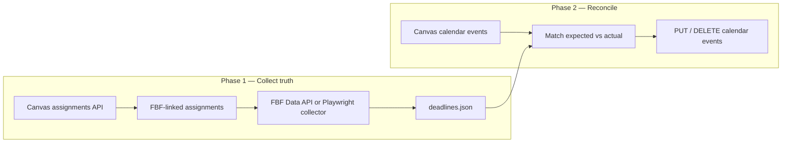
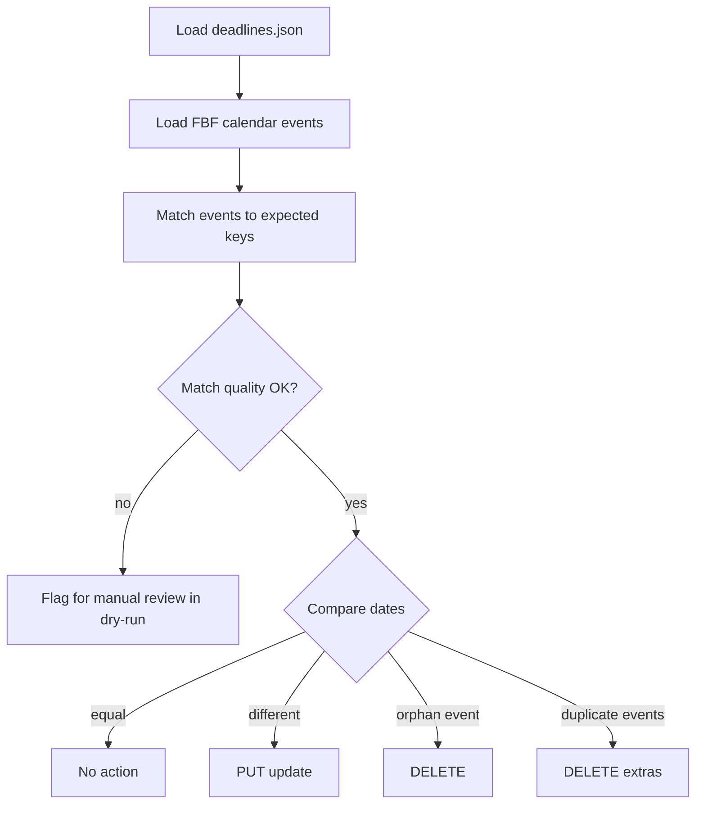

# Tool 2: FBF Calendar Sync

Reconcile Canvas calendar events with **current** Feedback Fruits assignment deadlines: update dates when they changed, remove orphans when assignments or steps were deleted, and collapse duplicate stale entries left by Feedback Fruits’ sync behavior.

---

## Table of contents

1. [The underlying problem](#the-underlying-problem)
2. [Shared building blocks](#shared-building-blocks)
3. [Purpose and use cases](#purpose-and-use-cases)
4. [Architecture overview](#architecture-overview)
5. [Data sources for FBF deadlines](#data-sources-for-fbf-deadlines)
6. [Reconciliation model](#reconciliation-model)
7. [Matching strategy](#matching-strategy)
8. [CLI workflow](#cli-workflow)
9. [Collector: fbf-collect](#collector-fbf-collect)
10. [Sync engine: fbf-sync](#sync-engine-fbf-sync)
11. [Time zones](#time-zones)
12. [UX and safety](#ux-and-safety)
13. [Token and permissions](#token-and-permissions)
14. [Comparison with Tool 1](#comparison-with-tool-1)
15. [Recommended rollout](#recommended-rollout)
16. [Suggested implementation stack](#suggested-implementation-stack)

---

## The underlying problem

Feedback Fruits uses the **Canvas Calendar Events API** (via institution-level API integration) to push assignment deadlines into the course calendar.

Per [Feedback Fruits: Synchronising Deadlines to Your LMS Calendar](https://help.feedbackfruits.com/hc/en-us/articles/23527088273298-Integrations-Synchronising-Deadlines-to-Your-LMS-Calendar):

| Behavior | Impact |
|----------|--------|
| Deadline changed in Feedback Fruits | A **new** calendar entry is synced; the **old one is not removed** |
| Assignment deleted in Feedback Fruits | The calendar entry **is not removed** |
| Multiple steps per activity | **Multiple** calendar events per activity (one per step) |

Students see **duplicate or outdated dates** on the Canvas calendar even when Feedback Fruits shows the correct deadlines.

Canvas native assignment `due_at` is **not** reliable for FBF activities—instructors should set due dates only in the FBF interface. This tool reconciles **`type=event`** calendar events against Feedback Fruits as the source of truth.

---

## Shared building blocks

### Authentication

| Variable | Description |
|----------|-------------|
| `CANVAS_BASE_URL` | Your institution’s Canvas URL |
| `CANVAS_ACCESS_TOKEN` | Access token via env or `.env` (**never commit**) |

### Canvas API essentials

| Operation | Endpoint |
|-----------|----------|
| List events | `GET /api/v1/calendar_events?type=event&context_codes[]=course_{id}&all_events=1` |
| Update event | `PUT /api/v1/calendar_events/:id` |
| Delete event | `DELETE /api/v1/calendar_events/:id` |
| Create event (optional) | `POST /api/v1/calendar_events` |
| List assignments | `GET /api/v1/courses/:course_id/assignments` |

Paginate via `Link` header. Rate-limit with backoff (~10 req/s).

### Identifying Feedback Fruits events

Same classifier as Tool 1—see [tool-1-calendar-purge.md](./tool-1-calendar-purge.md#identifying-feedback-fruits-events). Run `--inspect` before first sync.

### Safety defaults

| Flag | Behavior |
|------|----------|
| `--dry-run` | Show planned updates/deletes without applying |
| `--apply` | Execute reconciliation |
| Confidence threshold | Low-confidence matches flagged for manual review in dry-run |

---

## Purpose and use cases

| Scenario | What sync does |
|----------|----------------|
| **Deadline moved in FBF** | Updates the calendar event to the new date; removes stale duplicate |
| **Step removed or deadline cleared** | Deletes orphan calendar events |
| **Assignment deleted in FBF** | Deletes leftover calendar events |
| **After many edits** | Collapses N duplicate events down to one per current step |

**Complement to Tool 1:** Use [purge](./tool-1-calendar-purge.md) for one-time migration wipes; use **sync** for ongoing calendar hygiene during the term.

---

## Architecture overview

Sync is a **two-phase** pipeline because Feedback Fruits deadlines are **not** stored on the Canvas assignment record.



| Tier | Who runs it | How deadlines are read |
|------|-------------|-------------------------|
| **2a — Full auto** | EdTech / central IT | [Feedback Fruits Data API](https://help.feedbackfruits.com/hc/en-us/articles/34159260749458) (institution-enabled) |
| **2b — Instructor auto** | Individual instructor | **Playwright collector**: open each FBF Canvas assignment, read deadlines from UI or intercepted XHR → `deadlines.json` |

Most institutions start with **2b** unless the Feedback Fruits Data API is enabled for your account.

---

## Data sources for FBF deadlines

| Source | Pros | Cons |
|--------|------|------|
| **Feedback Fruits Data API** | Fully automated, institutional scale | Requires partner/IT enablement |
| **Playwright collector (`fbf-collect`)** | Works for individual instructors with a token | Fragile to UI changes; needs browser session |
| **Manual CSV / export** | Reliable fallback | Not fully automatic; extra instructor step |

**Not available for sync:** Canvas assignment `due_at` on external-tool shells (often empty by design; setting it creates duplicate calendar noise).

---

## Reconciliation model

Treat the problem as **set sync** between **expected deadlines** (from FBF) and **actual calendar events** (from Canvas).

### Expected deadline record

```json
{
  "key": "canvas_assignment_987|step:give_feedback",
  "canvas_assignment_id": 987,
  "step_label": "Give Feedback",
  "assignment_title": "Peer Review Essay 1",
  "due_at": "2026-03-15T23:59:00Z"
}
```

### Action matrix

| Situation | Action |
|-----------|--------|
| 1 calendar event, 1 expected deadline, **dates differ** | `PUT /calendar_events/:id` — update `start_at` / `end_at` |
| **N** calendar events, 1 expected deadline (duplicates) | Keep best match (closest date or newest `created_at`); **DELETE** the rest |
| 1 calendar event, **0** expected deadlines | **DELETE** (orphan / deleted FBF activity or step) |
| 0 calendar events, 1 expected deadline | **Optional** `POST` new event (repair mode; usually FBF creates these on save) |



---

## Matching strategy

Feedback Fruits titles often look like:

```text
{Step name} - {Assignment name in FBF}
```

The FBF assignment title may **differ** from the Canvas assignment shell title.

### Matching order (highest confidence first)

1. **Stable ID** in event `description` (if FBF embeds activity/step id—verify with `--inspect`).
2. **`canvas_assignment_id`** parsed from description link → map to step via title suffix.
3. **Fuzzy title match** — normalize (`lower`, strip punctuation), match `step + assignment` token overlap; require minimum score in dry-run report.

### Duplicate handling

When several events match one expected key:

- Prefer the event whose `start_at` is **closest** to expected `due_at`, or
- Prefer the **newest** `created_at` if dates are equally wrong,
- Delete all other matches for that key.

---

## CLI workflow

```bash
# Phase 1: collect current deadlines from Feedback Fruits
fbf-collect --course-id 12345 --headed
# writes deadlines.json

# Phase 2: preview reconciliation
fbf-sync --course-id 12345 --deadlines deadlines.json --dry-run

# Phase 2: apply changes
fbf-sync --course-id 12345 --deadlines deadlines.json --apply
```

### Optional flags

| Flag | Purpose |
|------|---------|
| `--min-confidence 0.85` | Skip ambiguous matches unless overridden |
| `--create-missing` | POST new calendar events for expected deadlines with no event |
| `--inspect` | Dump match diagnostics and sample event JSON |

---

## Collector: fbf-collect

**Purpose:** Build `deadlines.json` — the source of truth for Phase 2.

### Algorithm

1. `GET /api/v1/courses/:course_id/assignments`
2. Filter assignments where `submission_types` includes `external_tool` and tool URL/name matches Feedback Fruits.
3. For each assignment, open `/courses/:id/assignments/:assignment_id` in Playwright (instructor session or Canvas cookie).
4. Inside the FBF iframe (or via network interception), extract:
   - Step names (e.g. Submissions, Give Feedback, Read Feedback)
   - ISO 8601 deadlines per step
5. Write `deadlines.json` keyed for the sync matcher.

### Example `deadlines.json`

```json
{
  "course_id": 12345,
  "collected_at": "2026-05-29T12:00:00Z",
  "deadlines": [
    {
      "key": "canvas_assignment_987|step:submissions",
      "canvas_assignment_id": 987,
      "step_label": "Submissions",
      "assignment_title": "Peer Review Essay 1",
      "due_at": "2026-02-01T04:59:00Z"
    },
    {
      "key": "canvas_assignment_987|step:give_feedback",
      "canvas_assignment_id": 987,
      "step_label": "Give Feedback",
      "assignment_title": "Peer Review Essay 1",
      "due_at": "2026-02-08T04:59:00Z"
    }
  ]
}
```

### Implementation notes

- Use **Playwright** (recommended over Selenium for iframes).
- Cache DOM selectors in `fbf_selectors.yaml` per institution; version when FBF UI changes.
- **2a variant:** replace collector with HTTP client to Feedback Fruits Data API when IT provides credentials and base URL.

---

## Sync engine: fbf-sync

**Purpose:** Apply the reconciliation model using Canvas API only.

### Algorithm

1. Load `deadlines.json` (or fetch from Data API).
2. Paginate all FBF-classified calendar events for the course.
3. Run matching → build action list (PUT / DELETE / optional POST).
4. In dry-run: print table + low-confidence warnings.
5. On `--apply`: execute actions with rate limiting.
6. Write `sync-report.csv`: `event_id`, `action`, `old_date`, `new_date`, `match_key`, `confidence`, `reason`.

### Example dry-run output

```
Course 12345 — sync preview

UPDATE  event 88421  2025-09-10 → 2026-02-08  Give Feedback - Peer Review 1  (conf: 0.96)
DELETE  event 88422  2025-09-17 (duplicate)   Give Feedback - Peer Review 1  (conf: 0.94)
DELETE  event 90100  2025-10-01 (orphan)     Read Feedback - Old Assignment   (conf: 0.88)

2 low-confidence matches skipped — see sync-report.csv
```

---

## Time zones

| Layer | Time zone behavior |
|-------|-------------------|
| **Feedback Fruits UI** | Shown in user’s **device** local time |
| **FBF exports / Data API** | Often **UTC** |
| **Canvas course** | `time_zone` on course object (e.g. `America/New_York`) |

**Recommendation:**

- Store all instants in **UTC** in `deadlines.json`.
- Convert to the **course time zone** when writing Canvas `start_at` / `end_at`.
- Document for instructors: “Exports are UTC; calendar displays in course time.”

See [Feedback Fruits: Timezones](https://help.feedbackfruits.com/hc/en-us/articles/31881868371986-Timezones-in-FeedbackFruits).

---

## UX and safety

| Feature | Description |
|---------|-------------|
| **Dry-run default** | Required first pass on every course |
| **Confidence threshold** | Prevents wrong-date updates on fuzzy matches |
| **sync-report.csv** | Full audit trail for instructional technology |
| **No silent mass delete** | Orphans only deleted when match key is confident or explicitly `--include-low-confidence` |

**Risk level:** Medium—a bad match moves a student-visible date. Always dry-run and spot-check flagged rows.

---

## Token and permissions

Required scopes:

- `url:GET|/api/v1/calendar_events`
- `url:PUT|/api/v1/calendar_events/:id`
- `url:DELETE|/api/v1/calendar_events/:id`
- `url:GET|/api/v1/courses/:course_id/assignments`

Optional:

- `url:POST|/api/v1/calendar_events` (repair / `--create-missing` mode)
- `url:GET|/api/v1/courses/:course_id` (course `time_zone`)

You need **teacher** or **admin** access to each target course.

For **Data API (2a):** separate credentials from your institution’s Feedback Fruits partner manager—not the Canvas token.

---

## Comparison with Tool 1

| | **Tool 1: Purge** | **Tool 2: Sync** |
|--|-------------------|------------------|
| **Best for** | Course copy, new semester, wipe slate | Ongoing teaching, after editing FBF deadlines |
| **Canvas API only?** | Yes | Phase 2 yes; Phase 1 needs FBF data |
| **Risk** | Low with tuned classifier | Medium: matching errors |
| **Complexity** | ~200–300 LOC | ~800–1500 LOC with Playwright |
| **Run frequency** | Once per migrated course | Weekly or after deadline changes |

See [tool-1-calendar-purge.md](./tool-1-calendar-purge.md) for the bulk-removal tool.

---

## Recommended rollout

1. **Ship and validate Tool 1** (`fbf-purge` + `--inspect`) to lock in FBF event detection on your instance.
2. **Pilot Tool 2** on one course:
   - Run `fbf-collect` → review `deadlines.json` with instructor
   - `fbf-sync --dry-run` → review report
   - `fbf-sync --apply` on a small course
3. Ask instructional technology whether **Feedback Fruits Data API** is enabled; if yes, replace Playwright with API fetch in Phase 1.
4. Document instructor workflow: run sync after bulk deadline changes in FBF.

---

## Suggested implementation stack

| Component | Recommendation |
|-----------|----------------|
| Language | Python 3.11+ (`requests`, `click`, `python-dotenv`) |
| Collector | Playwright |
| Packaging | `pip install -e .` with entry points `fbf-collect`, `fbf-sync`, `fbf-purge` |
| Config | `fbf_patterns.yaml` (event detection), `fbf_selectors.yaml` (collector DOM) |
| Later | Small web UI (Flask/FastAPI) hosted by EdTech—same core library |

---

## References

- [Feedback Fruits: Synchronising Deadlines to Your LMS Calendar](https://help.feedbackfruits.com/hc/en-us/articles/23527088273298-Integrations-Synchronising-Deadlines-to-Your-LMS-Calendar)
- [Feedback Fruits: Configuring the API for Canvas](https://help.feedbackfruits.com/hc/en-us/articles/23527057192338-Configuring-the-API-for-Canvas)
- [Feedback Fruits Data API (release notes)](https://help.feedbackfruits.com/hc/en-us/articles/34159260749458-Release-Notes-v2-126-March-2026)
- [Feedback Fruits: Timezones](https://help.feedbackfruits.com/hc/en-us/articles/31881868371986-Timezones-in-FeedbackFruits)
- [Canvas Calendar Events API](https://canvas.instructure.com/doc/api/calendar_events.html)
- [Cornell: Getting Started with Feedback Fruits](https://learn.canvas.cornell.edu/getting-started-with-feedbackfruits/) — manual calendar cleanup when deleting assignments
